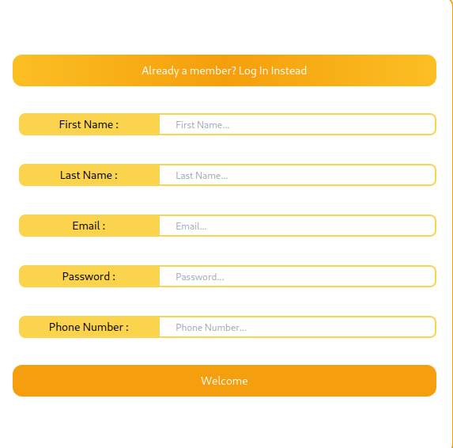
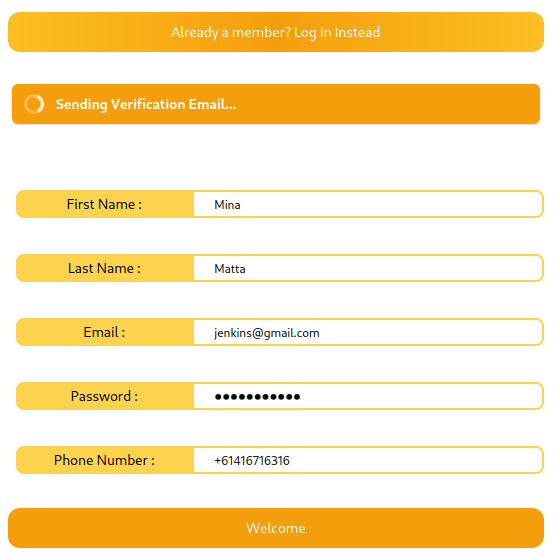
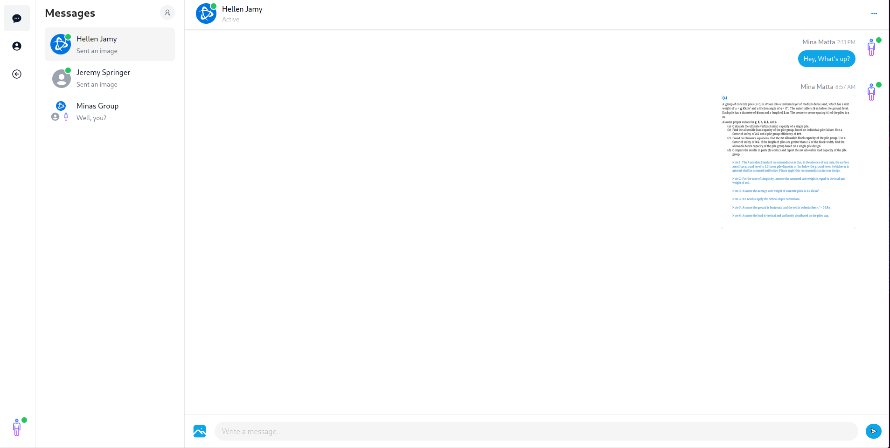

# WIP Leptos-Chatting-Client
This repository demonstrates the use of the following technologies:
* [Actix-web](https://actix.rs/): Actix based backend for request management.
* [Leptos-RS](https://github.com/leptos-rs/leptos): Server Side Rendering and Hydration framework utilizing web-assembly.
* [Cargo-Leptos](https://github.com/leptos-rs/cargo-leptos): Project Building Managed via Cargo Leptos.
* [Tokio-RS](https://tokio.rs/): Asynchronous Runtime
* [Wasm-Bindgen](https://github.com/rustwasm/wasm-bindgen): JSCast Bindings via web-assembly.
* [Sea-Orm](https://github.com/SeaQL/sea-orm): Asynchronous Object Relational Mapping (ORM) used for the management of MySQL Databases.
* [Tailwind-Css](https://tailwindcss.com/): Styles on the go.
* [Redis](https://redis.io/): User Session Management via Redis value stores.

## Features
* User Authentication and Verification
* Database Management w/ CRUD and SQL Join Statements. User Password hashing achieved via argon2.
* Asynchronous api calls
* React-like, fine grained reactive environment.
* Tailwind CSS compilation

## Coming Soon
### Signup

### Login

### Login Confirmation

### Chatting

